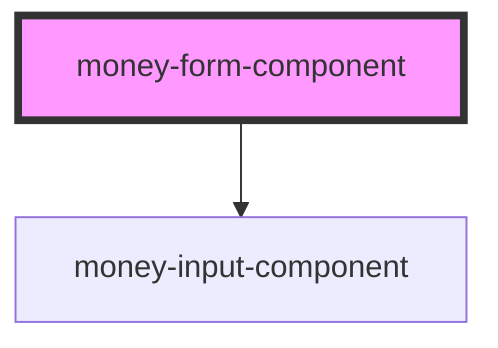

# money-form-component

Simple form using a child component for input money values in Euro and cents . The component is not aware of implementation of child component .

<!-- Auto Generated Below -->

## Events

| Event           | Description | Type               |
| --------------- | ----------- | ------------------ |
| `formSubmitted` |             | `CustomEvent<any>` |

## Dependencies

### Depends on

- [money-input-component](../money-input-component)

### Graph

----------------------------------------------

*Built with [StencilJS](https://stenciljs.com/)*
