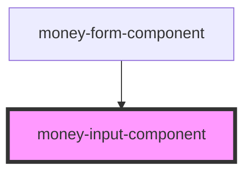

# money-input-component

Implements multiple inputs to collect values of amount in Euro and cents . Hides the implementation from its parents .

<!-- Auto Generated Below -->

## Properties

| Property    | Attribute   | Description | Type      | Default            |
| ----------- | ----------- | ----------- | --------- | ------------------ |
| `disabled`  | `disabled`  |             | `boolean` | `false`            |
| `required`  | `required`  |             | `boolean` | `false`            |
| `validator` | `validator` |             | `string`  | `decimalValidator` |

## Events

| Event         | Description | Type               |
| ------------- | ----------- | ------------------ |
| `valueChange` |             | `CustomEvent<any>` |

## Dependencies

### Used by

 - [money-form-component](../money-form-component)

### Graph

----------------------------------------------

*Built with [StencilJS](https://stenciljs.com/)*
